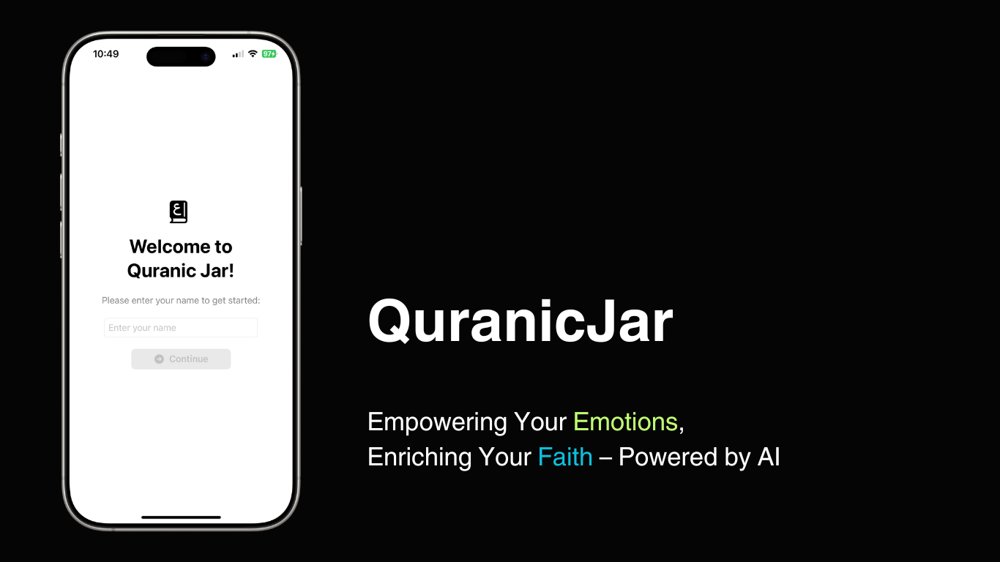
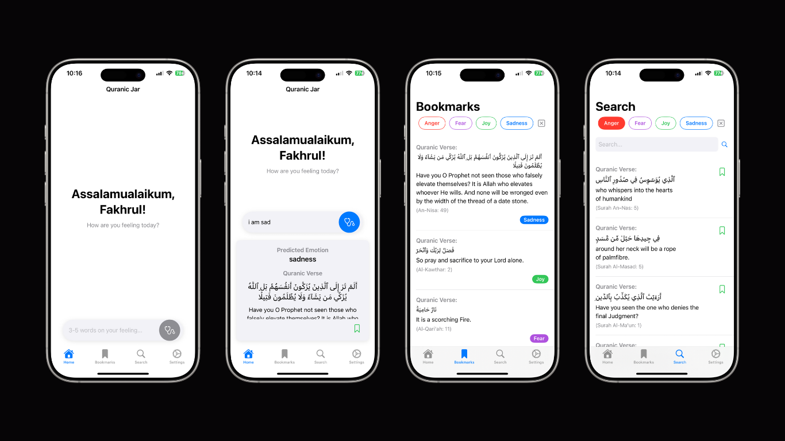
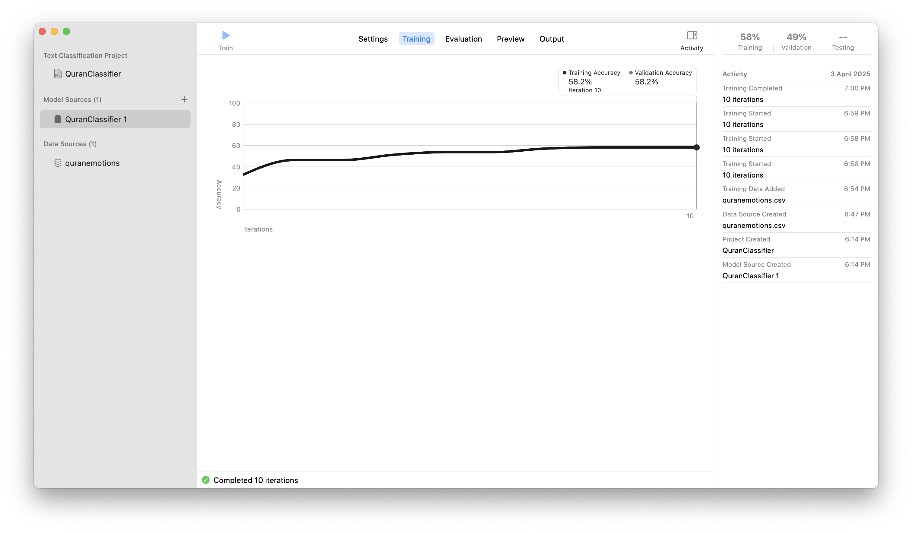

# QuranicJar (Native Version) 🕌✨

QuranicJar is a SwiftUI-based iOS application that predicts a user's emotion based on their input and provides a relevant Quranic verse for guidance and comfort. The app now uses a locally integrated Core ML `.mlmodel` for emotion classification, eliminating the need for a backend API. The Core ML model was trained locally on Macbook Pro M1 using Apple's Create ML.



## Table of Contents
- [Features](#features)
- [File Description](#file-descriptions)
- [How it Works](#how-it-works)
- [How to Run the Project](#how-to-run-the-project)
- [Current Results](#current-results)
- [Future Enhancements](#future-enhancements)
- [Contributions](#contributions)
- [Acknowledgments](#acknowledgments)
- [License](#license)

## Features



- **Emotion Prediction**: Users can input their feelings, and the app predicts their emotion using a Core ML model.
- **Supported Emotions**: As for now, there are 4 supported emotions which are **anger**, **fear**, **joy**, and **sadness**.
- **Quranic Verse Recommendation**: Based on the predicted emotion, the app provides a relevant Quranic verse for guidance.
- **Bookmark Verse**: Bookmark and filter your saved verses based on emotions.
- **Search Verse**: Search verses according to emotion types, Surah's name, or translation keywords.
- **On-Device Processing**: All emotion predictions are performed locally on the device using Core ML for improved privacy and performance.
- **Loading Indicator**: Displays a progress view while the emotion prediction is being processed.

### File Descriptions

1. **`QuranJarApp.swift`**:
   - The main entry point of the iOS app.

2. **`ContentView.swift`**:
   - The main screen where users can input their feelings, predict emotions, and view Quranic verses.
   - Uses the Core ML model for emotion prediction.

3. **`WelcomeView.swift`**:
   - The initial screen where users are greeted and asked to enter their name.

4. **`QuranClassifier.mlmodel`**:
   - A Core ML model fine-tuned for emotion classification.
   - Maps predicted emotions to Quranic verses using an embedded dataset.

5. **`quran_emotions_cleaned_2.csv`**:
   - A CSV file containing Quranic verses mapped to specific emotions.

## How It Works

1. The input text is processed by the Core ML model (`EmotionClassifier.mlmodel`) embedded in the app.
2. The predicted emotion is mapped to a relevant Quranic verse using the `quran_emotions_cleaned_2.csv` dataset.
3. The app displays the predicted emotion and the corresponding Quranic verse to the user.

---

## How to Run the Project

### Prerequisites

- macOS with Xcode installed.
- iOS 14.0 or later.
- Swift 5.0 or later.

### Steps

1. Clone the repository:
   ```bash
   git clone https://github.com/your-username/QuranicJar.git
   cd QuranicJar
   ```

2. Open the project in Xcode:
   ```bash
   open QuranicJarNative.xcodeproj
   ```

3. Build and run the app on a simulator or a physical device.

---

## Requirements

### iOS App
- iOS 14.0 or later
- Xcode 12.0 or later
- Swift 5.0 or later

---

## Current Results

### Model Performance



The Core ML model (`QuranClassifier.mlmodel`) was trained using Apple's Create ML with the `quran_emotions_cleaned_2.csv` dataset. Below are the key metrics from the training process:

- **Training Accuracy**: 58.2%
- **Validation Accuracy**: 58.2%
- **Iterations Completed**: 10

The model demonstrates moderate performance, which is expected given the limited dataset size and the complexity of emotion classification tasks. The training and validation accuracies being equal suggest that the model is not overfitting, but there is room for improvement in overall accuracy.

### Observations

1. **Dataset Size**: The dataset used for training (`quran_emotions_cleaned_2.csv`) may not have been large or diverse enough to capture the nuances of emotion classification effectively.
2. **Emotion Categories**: The model currently supports only four emotions: **anger**, **fear**, **joy**, and **sadness**. Expanding the emotion categories could improve the app's utility.
3. **Accuracy**: While the model is functional, the accuracy is relatively low for practical use in real-world scenarios. This could impact the reliability of emotion predictions.

---

## Future Enhancements

- Expand the dataset by collecting more data to improve the diversity and size of the training dataset.
- Experiment with different machine learning algorithms or architectures to improve accuracy.
- Add support for more emotions and Quranic verses.
- Improve the emotion prediction model with additional training data.
- Enhance the UI/UX of the iOS app.

---

## Contributions

Contributions are welcome! Please feel free to submit a Pull Request.

---

## Acknowledgments

- [Quran Dataset](https://www.kaggle.com/datasets/imrankhan197/the-quran-dataset)
- [Emotionally-Labeled Quran Verses (ELQV)](https://github.com/Arwaalmrzoqi/ELQV)
- [Core ML Documentation](https://developer.apple.com/documentation/coreml)

---

## License

This project is licensed under the MIT License. See the LICENSE file for details.

---

**Developed by Fakhrul Fauzi**
